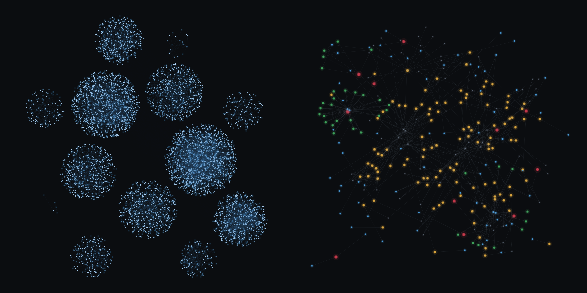

# Ayokunle Olufosoye

Systematic futures research, built solo by directing AI agents end to end. This repo is the
public face of that work: the methodology in full, the results in aggregate, the specifics
kept private.

---

## Solt — a falsification-first research program

Solt is a research operating system for CME index futures (NQ / ES / YM). Its design premise
is that most edges aren't real, so the system is built to kill ideas quickly and honestly —
and to make the surviving ones earn every step.

### The pipeline every idea passes through

1. **Recall** — has this idea, or a close relative, already died here? An append-only research
   memory answers before any new work is spent.
2. **Design review** — structural checks before anything runs: outcome-variance budgeting
   against the minimum detectable effect, payoff-shape analysis (what the trade's bracket
   guarantees by construction), and explicit null semantics — writing down what the null
   destroys and what it preserves, so the test can't confirm a foregone conclusion.
3. **Blind power pre-check** — feasibility and minimum detectable effect measured without ever
   looking at the candidate's sign or magnitude. Underpowered tests don't run; "null" and
   "couldn't have seen it" are never confused.
4. **Pre-registration** — SHA-pinned scripts, frozen seeds and thresholds, and both outcome
   branches written down *before* the first look at the data.
5. **One recorded look** — the measurement runs once, from the frozen artifact.
6. **Replication** — any survivor is presumed to be winner's curse until a pre-registered
   replication on untouched data says otherwise. Two discovery-window leads have been killed
   exactly this way; the discipline is the point.
7. **Forward confirmation and paper deployment** — replicated effects graduate to forward
   out-of-sample confirmation, then to a paper trading rail with decision- and fill-parity
   proofs against the backtest engine. Nothing touches real capital without promotion
   provenance the software itself enforces.
8. **Deposit** — every result, null or not, lands in an append-only ledger with full data
   provenance. Nulls are product: they are what keeps the trial count honest and the deflated
   Sharpe honest with it.

### By the numbers

| Measure | Value |
|---|---|
| Pre-registered, blinded research cycles | 14 |
| Rigorous null results banked (and kept) | most of them |
| Effects surviving replication + forward confirmation | 1 — 125 forward trades, sign-test p = 0.01, ~90% effect retention in replication |
| Automated tests behind the platform | 650+ (lint + type gates on every commit) |
| Design errors caught by adversarial review *before* measurement | 7 |
| Historical data processed | 4M+ one-minute bars across three symbols and five years |
| Total research data spend | under $30 |
| Live dollars risked | $0 — everything is paper-gated |

### The two brains, drawn

In the spirit of the AI-brain graphs — except this is the actual system, with the names removed.

**Left — the code graph.** 5,442 project-defined functions, classes, and modules; 10,837
call/import/reference edges extracted from the AST. Each nebula is one module of the platform;
the brighter cores are its most-connected symbols.

**Right — the research memory.** The append-only knowledge graph the program writes as it works:
hypotheses in red, experiments in green, findings in amber, factors in blue, context
cells in grey — linked by tested-by / uses / provenance edges. Every study deposits here, nulls
included; this graph is why the trial count stays honest.

The topology is real. The labels are deliberately absent — the structure is public, the contents
are not.

### The statistics under the hood

Combinatorially purged cross-validation · deflated Sharpe ratio at the honest trial count ·
Benjamini–Hochberg FDR across every pre-declared family · permutation and surrogate nulls that
traverse the full pipeline (raw bars → filters → encoding → statistic) · empirically calibrated
rejection thresholds with Clopper–Pearson bounds · deterministic, byte-identical
serial-vs-parallel Monte-Carlo calibration campaigns · adversarial multi-lens red-team review
of every design before it may spend data.

### What you won't find here

Signals, parameters, hypotheses, level definitions, or anything that would let a reader
reconstruct the live research directions. The process is public; the findings are the
inventory.

### Coming over time

Sanitized write-ups of *closed* research threads — the methodology lessons, the null designs
that failed interestingly, the statistical traps that got caught — published once a thread is
fully resolved and safely behind the program.

---

## Also building

**BinBuddy** — a household consumption-scanning app (Flutter/MLKit, event-sourced,
offline-first) designed toward an anonymized, demographically re-weighted consumption panel:
alt-data for quantitative funds. Early build.

---

## Background

FMDQ-Next trading competition winner (Lagos, 2018 — youngest participant in the cohort) and
FMDQ Group intern (2019). Austin College engineering physics & computer science. Now building
the research program above while working full-time.

## Contact

**soltfiish@gmail.com** · [LinkedIn](https://www.linkedin.com/in/ayokunle-olufosoye-243027404/)
